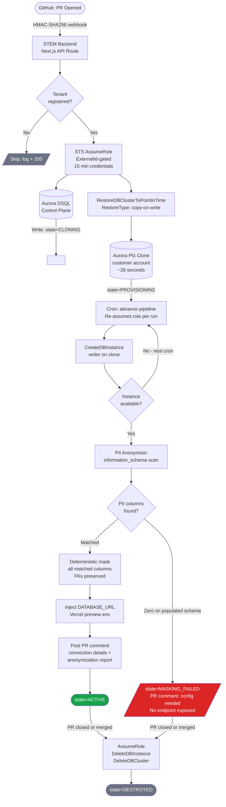
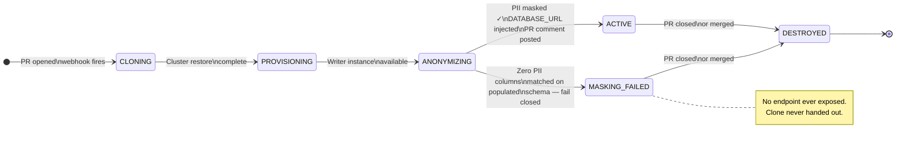
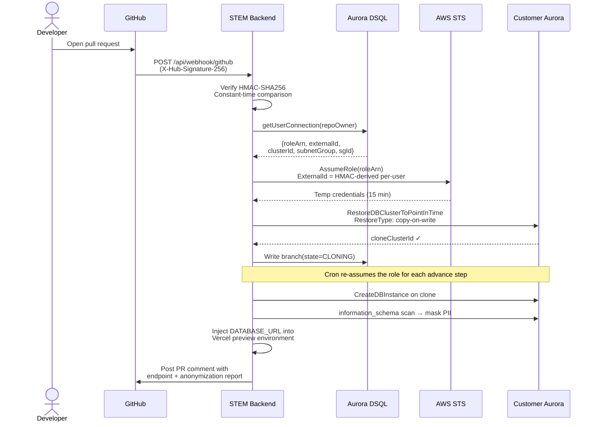
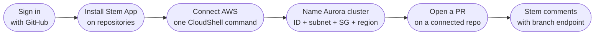

<div align="center">

# STEM

**Isolated, PII-anonymized Aurora PostgreSQL branches for every pull request.**

[](https://stem-frontend-six.vercel.app)

[](https://nextjs.org/)
[](https://www.typescriptlang.org/)
[](https://aws.amazon.com/rds/aurora/)
[](https://aws.amazon.com/rds/aurora/dsql/)
[](https://vercel.com)
[](https://github.com/apps/stem-ci-andrew-kevin-007)
[](#security-model)
[](https://h0.vercel.app)

> Every PR gets its own Aurora clone, PII anonymized, auto-destroyed on close.  
> Sub-30 second provisioning. $0.22/day for two active branches. Fails closed on unmasked schemas.

</div>

---

## The Problem

Teams with regulated data face an impossible choice on every pull request:

- **Test against seed data** — miss bugs that only appear at production scale (slow queries, lock contention, edge-case rows)
- **Test against production** — expose real PII to every reviewer, contractor, and preview deployment

Stem eliminates the trade-off. Every PR gets a full-shaped clone of your production Aurora cluster with personal data replaced by realistic fakes, provisioned in ~28 seconds, destroyed automatically on PR close. Clones run in the customer's own AWS account — production-shaped data never leaves the customer's boundary.

---

## Architecture



---

## Branch State Machine



---

## Cross-Account IAM Flow



---

## How Two AWS Databases Power This

Stem uses both AWS databases for distinct, non-interchangeable roles:

| | Aurora PostgreSQL Serverless v2 | Aurora DSQL |
|---|---|---|
| **Role** | Data plane — tenant clones | Control plane — pipeline metadata |
| **What lives here** | Actual PR branch databases | Branch state, user connections, audit logs |
| **Why this one** | Copy-on-write storage: clone shares source pages, only diverges on writes. 28-second clone of any size. | Serverless, scales to zero, IAM-authenticated, no connection pool to operate. Handles concurrent webhook writes without contention. |
| **Billing** | ACU-based — idle clones cost ~$0.01/hr | Per-request — zero cost between PR bursts |

---

## Data Safety: Fail-Closed Anonymization

The anonymizer runs inside the clone **before any credentials are issued**. Two detection layers:

1. **Explicit rules** — high-confidence column names with known replacement strategies
2. **Generic scan** — queries `information_schema.columns` across every table, matches text columns against PII patterns:

| Pattern category | Examples matched |
|---|---|
| Email | `email`, `user_email`, `contact_email` |
| Phone | `phone`, `phone_number`, `mobile`, `cell` |
| Identity | `ssn`, `national_id`, `tax_id`, `passport` |
| Payment | `card_number`, `credit_card`, `pan` |
| Names | `first_name`, `last_name`, `full_name`, `display_name` |
| Location | `address`, `street_address`, `postal_code`, `zip` |
| Network | `ip_address`, `ip_addr`, `client_ip` |
| Temporal | `dob`, `date_of_birth`, `birth_date` |
| Secrets | `password`, `secret`, `token`, `api_key` |

**Design bias: over-mask.** Writing fake data into a non-sensitive column of a throwaway clone is harmless. Leaving one real PII column unmasked is a breach.

**Fail closed.** If the anonymizer scans a populated schema and matches **zero** PII columns, the branch moves to `MASKING_FAILED`:
- No connection string is published
- No `DATABASE_URL` is injected into Vercel
- PR receives a comment explaining masking configuration is required
- Clone is never exposed

Stem never hands out a database it could not anonymize.

| Column type | Replacement |
|---|---|
| email | `user_NNNNNN@example.com` |
| phone | Random E.164-style US number |
| SSN / national ID | `NNN-NN-NNNN` |
| Card number | `****-****-****-NNNN` |
| Name | Fixed synthetic pool (referentially stable) |
| Address | `NNN Example St, Anytown USA 10001` |
| Postal code | Random 5-digit |
| IP address | RFC 1918 random address |
| Date of birth | Fixed placeholder |
| Password / secret | `redacted_<short hash>` |

Fake values are **deterministic per source value** — the same real email always maps to the same fake email, so foreign key joins across tables still work after masking.

---

## Multi-Tenancy and Isolation

Stem is multi-tenant **by AWS account**, not by row in a shared database.

| Boundary | Mechanism |
|---|---|
| Compute + data | Each tenant's clones run in their own AWS account via cross-account STS `AssumeRole`. Stem stores no long-lived tenant credentials — only a role ARN and ExternalId. |
| Blast radius | Destructive and modifying permissions (`DeleteDBCluster`, `DeleteDBInstance`, `ModifyDBCluster`) are IAM-scoped to `stem-pr-*` resources. Stem cannot touch the tenant's source cluster. |
| Confused deputy | Every role assumption requires a per-user HMAC-derived `ExternalId`. |
| Dashboard visibility | Branch queries are scoped to the authenticated user's GitHub login. One tenant cannot enumerate another's branches. |
| Operator | The operator login uses an environment-configured cluster, independent of any customer path. |

---

## Security Model

- **Transport** — HSTS (2 years, `includeSubDomains`, `preload`), strict CSP (`frame-ancestors 'none'`, `object-src 'none'`), `X-Frame-Options: DENY`, `X-Content-Type-Options: nosniff`
- **Sessions** — AES-256-GCM sealed, `httpOnly`, `SameSite=Lax` cookies, 12-hour TTL. GitHub token never reaches the browser. Fails closed with no `AUTH_ENCRYPTION_KEY`.
- **OAuth** — Single-use sealed `state` cookie for CSRF. Code-to-token exchange server-side. Errors logged server-side, never reflected into redirect URLs.
- **Webhook** — HMAC-SHA256 verified with constant-time comparison. Missing secret or malformed header → 401, never 500.
- **Pipeline trigger** — `/api/cron/advance-pipeline` requires `CRON_SECRET` bearer token. Disabled in production if unset.
- **Internal write path** — `/api/connections` guarded by `STEM_INTERNAL_TOKEN`, constant-time comparison, fails closed in production.
- **Least privilege** — Customer IAM role: `Describe*` account-wide (RDS limitation), `Create*` for clone provisioning, modify/delete locked to `arn:aws:rds:*:*:cluster:stem-pr-*` and `arn:aws:rds:*:*:db:stem-pr-*`.
- **Database TLS** — Masking connection uses TLS; supply `AURORA_CA_CERT` to enforce certificate verification.

---

## Stack

```
Frontend / Backend    Next.js 15 (App Router), TypeScript strict, Tailwind CSS
Deployment            Vercel (two projects: backend root, frontend /frontend)
Data plane            AWS Aurora PostgreSQL Serverless v2
Control plane         AWS Aurora DSQL
Auth                  GitHub App OAuth (user-to-server), AES-256-GCM sealed sessions
IAM                   AWS STS cross-account AssumeRole, CloudFormation stack per tenant
GitHub integration    @octokit/app, HMAC-SHA256 webhook verification
AWS SDK               @aws-sdk/client-rds, @aws-sdk/client-sts, @aws-sdk/dsql-signer
```

---

## Deployment

Two Vercel projects: backend (repo root) and frontend (`frontend/`).

```bash
git clone https://github.com/Andrew-Kevin-007/stem-app
cd stem-app

# Backend
cp .env.example .env.local      # fill in per table below
npm install
npx vercel --prod

# Frontend
cd frontend
cp .env.example .env.local      # set NEXT_PUBLIC_API_BASE to the backend URL
npm install
npx vercel --prod
```

**GitHub App (one-time):**
1. Create a GitHub App with `Pull requests: write` and `Contents: read`
2. Subscribe to the `pull_request` webhook → `{backend}/api/webhook/github`
3. Set OAuth callback → `{frontend}/api/auth/github/callback`
4. Generate a client secret and a private key

`STEM_INTERNAL_TOKEN` and `CRON_SECRET` must be identical on both projects. After deploying, verify: `GET /api/health` on each — frontend should return `ready: true`, backend should return an all-true `config` object.

### Backend environment

| Variable | Required | Purpose |
|---|---|---|
| `AWS_ACCESS_KEY_ID`, `AWS_SECRET_ACCESS_KEY`, `AWS_REGION` | Yes | Control-plane credentials (DSQL, operator cluster, STS) |
| `DSQL_ENDPOINT` | Yes | Aurora DSQL endpoint (no scheme) |
| `AURORA_SOURCE_CLUSTER_ID`, `AURORA_SUBNET_GROUP`, `AURORA_SECURITY_GROUP_ID` | Operator path | Operator's source cluster for the operator login's repos |
| `AURORA_MASTER_USER`, `AURORA_MASTER_PASSWORD` | Operator path | Operator clone credentials |
| `GITHUB_APP_ID`, `GITHUB_APP_PRIVATE_KEY`, `GITHUB_WEBHOOK_SECRET` | Yes | GitHub App identity and webhook HMAC |
| `VERCEL_TOKEN`, `VERCEL_PROJECT_ID` | Operator path | `DATABASE_URL` injection into the preview project |
| `STEM_INTERNAL_TOKEN` | Yes | Guards `/api/connections`; must match the frontend |
| `CRON_SECRET` | Yes | Guards the pipeline trigger; must match the frontend |
| `STEM_OPERATOR_LOGIN` | No | Login that uses the environment cluster (default `Andrew-Kevin-007`) |
| `STEM_TENANT_DB_SECRET` | No | Derives per-clone master passwords (falls back to webhook secret) |
| `AURORA_CA_CERT` | No | RDS CA bundle (PEM) to enforce TLS verification during masking |

### Frontend environment

| Variable | Required | Purpose |
|---|---|---|
| `NEXT_PUBLIC_API_BASE` | Yes | Backend URL (no trailing slash) |
| `APP_BASE_URL` | Yes (production) | Public frontend origin for stable OAuth redirect URIs |
| `AUTH_ENCRYPTION_KEY` | Yes | 32+ random bytes; seals session cookies. App fails closed in production without it. |
| `GITHUB_CLIENT_ID`, `GITHUB_CLIENT_SECRET` | Yes | GitHub App OAuth credentials |
| `GITHUB_APP_SLUG` | No | Install-link slug |
| `AWS_ACCESS_KEY_ID`, `AWS_SECRET_ACCESS_KEY`, `AWS_REGION` | Yes | STS AssumeRole verification during tenant onboarding |
| `STEM_AWS_ACCOUNT_ID` | No | Trusted principal; auto-derived via STS `GetCallerIdentity` |
| `STEM_AWS_EXTERNAL_ID_SECRET` | No | ExternalId derivation secret (falls back to session secret) |
| `STEM_INTERNAL_TOKEN` | Yes | Must match the backend |
| `CRON_SECRET` | Yes | Must match the backend |

---

## Tenant Onboarding



**Step-by-step:**

1. **Sign in with GitHub** — OAuth reads only the public profile
2. **Install the Stem App** on repositories that should receive database branches
3. **Connect AWS** — run the single CloudShell command shown on the Connect page:
   ```bash
   curl -fsSL https://stem-frontend-six.vercel.app/api/aws/template -o /tmp/stem-role.json \
   && aws cloudformation deploy \
     --stack-name stem-access \
     --template-file /tmp/stem-role.json \
     --capabilities CAPABILITY_NAMED_IAM \
     --parameter-overrides ExternalId=stem-<your-id> \
   && aws cloudformation describe-stacks \
     --stack-name stem-access \
     --query "Stacks[0].Outputs[?OutputKey=='RoleArn'].OutputValue" \
     --output text
   ```
   Paste the printed role ARN back into Stem.
4. **Name the Aurora cluster** — provide the source cluster ID, subnet group, security group, and region. Stem verifies the role can describe the cluster before saving.

Open a PR on any connected repository. Stem comments with the branch endpoint once masking completes.

---

## Operations

| Task | How |
|---|---|
| Health check | `GET /api/health` on both apps — returns `ok` + config-presence booleans, never secret values |
| Manual pipeline advance | Dashboard → Advance Pipeline button (session-gated, forwards `CRON_SECRET`) |
| Automatic cron | `vercel.json` schedules daily (Hobby limit); upgrade to a paid plan for minute-level scheduling |
| Logs | Platform function logs on Vercel; dashboard event stream shows live state transitions |

---

## Troubleshooting

| Symptom | Resolution |
|---|---|
| Sign-in shows "not configured" | Set `GITHUB_CLIENT_ID`, `GITHUB_CLIENT_SECRET`, `AUTH_ENCRYPTION_KEY`; redeploy. Check `/api/health`. |
| `state_mismatch` during OAuth | Retry in the same browser tab. Ensure cookies are allowed for the production URL, not a preview deployment URL. |
| AWS connect: AssumeRole fails | IAM is eventually consistent — wait ~30s and retry. Confirm the CloudFormation stack deployed in the correct account and the ExternalId matches. |
| Cluster step fails | Verify cluster ID and region. Confirm the role allows `rds:DescribeDBClusters`. |
| Branch shows "Needs Masking" | The schema had no columns Stem recognized as PII. Align column names or open an issue to add detection rules. Stem withheld the clone intentionally. |
| Stem bot never comments | Confirm the App is installed on the repository. No workflow file required. |
| Branch stuck in Queued | Aurora allows up to 15 clones per source cluster. Close stale PRs to drain the queue. |

---

## Known Constraints

- Vercel Hobby cron runs at most daily; use the Advance Pipeline button for demos or upgrade for automatic progression
- Aurora allows up to 15 clones per source cluster; additional PRs queue
- Aurora DSQL has no foreign-key constraints; numeric columns serialize as strings over the PostgreSQL wire protocol — the frontend normalizes all payloads
- Anonymization requires the clone's master username and database name (collected on the Connect page, both default to `postgres`)

---

## License

MIT — built for the H0 hackathon (Vercel + AWS Databases, deadline 2026-06-30).  
Engineered for real-world multi-tenant deployment.
